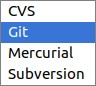

# Introduction to HTTP and REST API testing

This workshop is an introduction to the world of HTTP and REST API testing for direct test or as prerequisites for your end to end test automation suite.

You will learn:
- how HTTP works as an application layer protocol
- what is a REST API and why they are now so common
- how to setup a basic API testing/rpa project using the RequestsLibrary
- how to perform different HTTP requests
- how to validate the response
- how to handle shared session and authentication
- what to address with api testing in your test suite

We will use the new 0.9 pre-release version and we will talk about the RequestsLibrary development roadmap.

Most of the workshop **is hands on and highly interactive**: we will use mob programming techniques.

## What you need
- I will use PyCharm as IDE (but of course you can use your own) 
- git
- Python
- Docker (needed to run a local HTTP server)

## How to setup a basic API testing/rpa project using the RequestsLibrary

#### Checkout a new project from git

From cli:

    git clone git@github.com:RobotFramework-Italia/http-api-testing-workshop.git
    
or

    git clone https://github.com/RobotFramework-Italia/http-api-testing-workshop.git

Or gui:

#### Setup a new Python virtual environment

#### Install the needed dependencies

    pip install -r requirements.txt 
    
#### Run a local HTTP sever with Docker

    docker run -p 5000:80 kennethreitz/httpbin
    
Wait until everything is up and running and then open the browser at this url: http://localhost:5000/

#### Run a self check test

    robot selfcheck/selfcheck.robot
