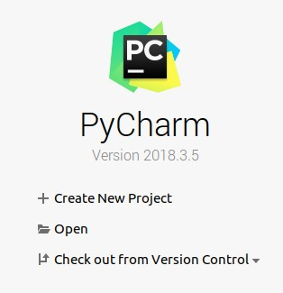
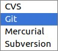
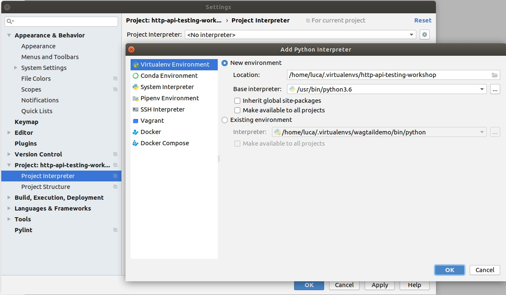

# HTTP API TESTING AND RPA WITH REQUESTSLIBRARY

This workshop is about HTTP api for direct test or as prerequisites for your end to end test automation suite.

You will learn:
- how to setup a basic API testing/rpa project using the RequestsLibrary
- how to handle shared session and authentication
- how to validate the response
- what to address with api testing in your test suite
- how to use RF for basic stress tests
- how to use pabot and RequestsLibrary to execute many requests in parallel
We will use the new 0.8 pre-release version and we will talk about the development roadmap.

## What you need
- I will use PyCharm as IDE (but of course you can use your own) 
- git
- Python
- Docker (needed to run a local HTTP server)

## How to setup a basic API testing/rpa project using the RequestsLibrary

#### Checkout a new project from git

From cli:

    git clone git@github.com:RobotFramework-Italia/http-api-testing-workshop.git
    
or

    git clone https://github.com/RobotFramework-Italia/http-api-testing-workshop.git

Or gui:

#### Setup a new Python virtual environment

#### Install the needed dependencies

    pip install -r requirements.txt 
    
#### Run a local HTTP sever with Docker

    docker run -p 5000:80 kennethreitz/httpbin
    
Wait until everything is up and running and then open the browser at this url: http://localhost:5000/

#### Run a self check test

    robot selfcheck/selfcheck.robot
