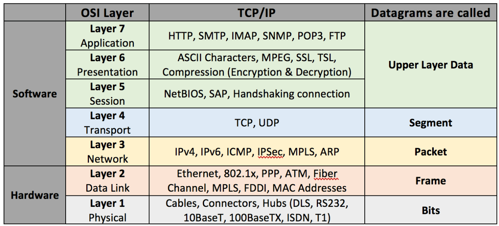

### Welcome
- Short presentation of myself
- Attendees presentation
  - where are you from?
  - how do you use RobotFramework?
  - RF and Python knowledge

### RequestsLibrary
- https://github.com/MarketSquare/robotframework-requests
  - 0.9
  - project structure
  - documentation 
  - examples
- https://requests.readthedocs.io/en/master/
  - original requests library documentation

### How HTTP works as an application layer protocol
- OSI layer 

- layer 7: Application a text protocol over a TCP connection
- telnet example: 
  ```
  telnet www.google.com 80
  GET / HTTP/1.1
  Host: google.com
  ```
  - **🛠 ️[hands on]** try on your own
  - **☝️ [challenge]** how to add headers 
  - **☝️ [challenge]** what do you notice about the protocol structure?  
- request
- response
  - status-line (code, reason)
      - Informational 1XX
      - Successful 2XX
      - Redirection 3XX
      - Client Error 4XX
      - Server Error 5XX
  - headers
  - CRLF  
  - body
- curl

### What is a REST API and why they are now so common

[Good API best practices reference](https://docs.microsoft.com/en-us/azure/architecture/best-practices/api-design)

- Why?
  - open standard
  - simple  
  - platform independence
  - service evolution
  - scalable

#### Introduction  
An architectural approach to designing web services. 
REST is an architectural style for building distributed systems based on hypermedia.
REST is independent of any underlying protocol and is not necessarily tied to HTTP.
However, most common REST implementations use HTTP as the application protocol.

Representational State Transfer (REST) main concepts:
- Resources
- A resource haas an identified
- Interaction with a resource representation
- Uniform interface that uses HTTP verbs
- Stateless (transient, atomic) to enable scalability
- Driven by hypermedia links

Topics to cover:
- Organize the API around resources
- Define operations in terms of HTTP methods
- Media types
- Filter and paginate
- HATEOAS, or Hypertext as the Engine of Application State
- Versioning
- OpenAPI / Swagger

### How to setup a basic API testing/rpa project using the RequestsLibrary
- see README.md
- **🛠️ [hands on]** setup the environment and run selfcheck
- basic example
  - testcase
  - resp.text
  - logs
  - **🛠️ [hands on]** customize your own example with a different website
- test websites
  - https://httpbin.org/
  - https://jsonplaceholder.typicode.com/
  - **🛠️ [hands on]** test on the local httpbin server

### How to perform different HTTP requests
- session example
  - configuration file
  - external and reusable resources
  - **🛠️ [hands on]** customize adding a new website configuration and keyword
- more on session example
  - parameters
  - json body
  - POST requests
  - **🛠️ [hands on]** use parameters with a new website
    - common parameters pitfalls 
  - **🛠️ [mob]** post a json body
- json session example
  - PUT requests
  - PATCH requests
  - DELETE requests
  - Filtering resources

### How to handle shared session and authentication
- httpbin Basic Auth
- branch 1-shared-session
  - advantages of common headers for sessions
- more complex example:
  - oauth2 authentication
  - different roles / scope
- global session atest setup

### How to validate the response
- branch 2-response
- response object
  - python way challenge
  - https://2.python-requests.org/en/master/api/?highlight=response#requests.Response
- json response
  - challenge assert https://jsonplaceholder.typicode.com/posts/1 contains optio
- status assertion
- implicit status assert
  - specific implicit status assert
  - nested keywords that handle negative tests
- jsonpath https://github.com/peterservice-rnd/robotframework-jsonvalidator

### What to address with api testing in your test suite
 - testing pyramid  
   
   - integration and component tests as far as a whole system is up are still somehow e2e
 - setup user generator
 - data preparation setup examples

### How to use RF for basic stress tests
- RF for loops
- sh for loops
- data generation
- data driver

### How to use pabot and RequestsLibrary to execute many requests in parallel
- realworld examples: 
  - user delete
  - data sync
  - example unsubscribe 
- data driver + pabot
  - test level split
  - different configurations

### We will use the new 0.8 version and we will talk about the development roadmap
- new keyword structure
- project and next milestones
- how to contribute
- challenge cookie test
